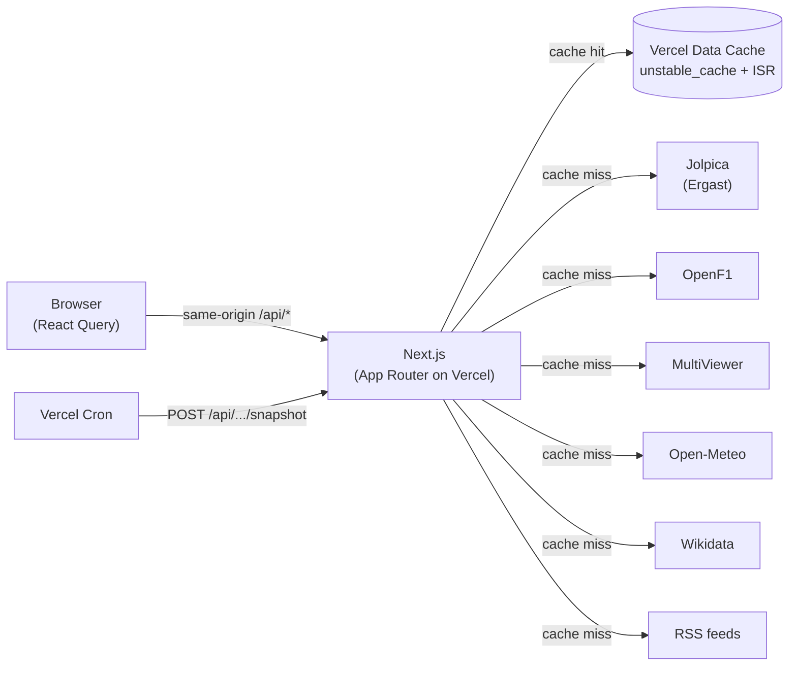
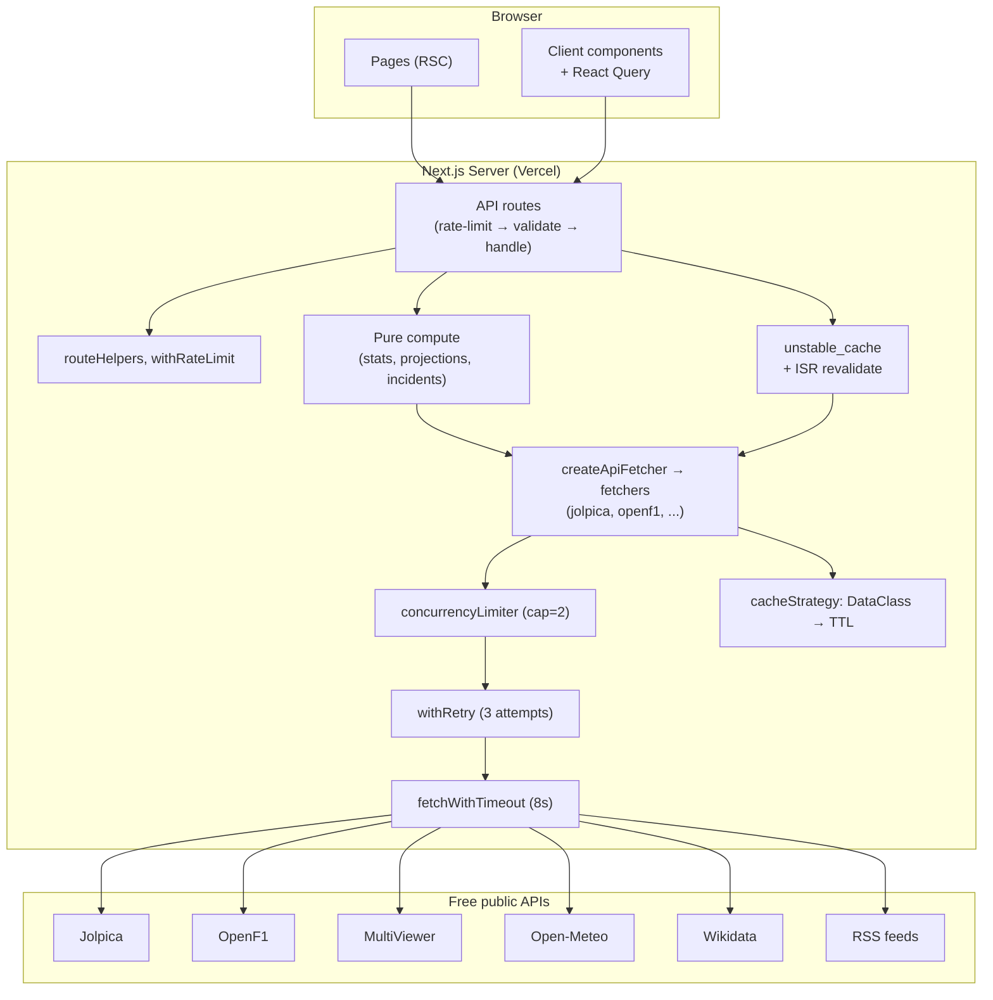

# 03 — Architecture

## System context

Every browser request talks only to our Next.js app. The app aggregates several
free public APIs server-side, caches the results, and returns clean JSON.

Diagram: [Mermaid (renders on GitHub)](diagrams/mermaid/system-context.md) · [PlantUML source](diagrams/puml/system-context.puml).

## Hard invariants

These are non-negotiable. Anything that breaks one will be caught by tests,
build, lint, or code review.

1. **Browser never calls third-party APIs directly.** The CSP in
   [next.config.ts](../next.config.ts) sets `connect-src 'self'`. All upstream
   calls happen inside `/api/*` routes.
2. **Every external fetcher goes through `createApiFetcher`** (see
   [05-data-fetching.md](05-data-fetching.md)). This gives us timeout, retry,
   and per-service concurrency caps for free.
3. **Every fetcher declares a `DataClass`.** No magic TTL numbers. See
   [06-caching.md](06-caching.md).
4. **Routes call `rateLimited(req, routeKey)` first** before any work.
5. **Routes validate every external input** with a regex from
   [src/lib/validators.ts](../src/lib/validators.ts).
6. **Routes return graceful errors** via `badRequest()` / `serverError()` from
   [routeHelpers.ts](../src/lib/api/routeHelpers.ts) — never hand-rolled.
7. **Pages prefer `Promise.allSettled()`** so one upstream failure doesn't blank
   the whole page.
8. **No hardcoded colors.** All colors come from CSS variables in
   [globals.css](../src/app/globals.css).
9. **Segment config exports are literals.** `export const revalidate = 21600;`
   not `6 * 3600`. Next's build pipeline requires literal values here.
10. **Tests and `npm run build` must pass before push** when touching
    `src/app/**`.

## Layered architecture

## Why these layers exist

| Layer | Solves |
|---|---|
| Pages / components | Render. Stay dumb where possible. |
| API routes | Single authoritative shape for each resource. Browser only knows our schema. |
| `unstable_cache` + ISR | Cross-lambda caching without an external store. |
| Pure compute (`stats/`, `projections/`) | Lets us unit-test the math without mocking HTTP. |
| `createApiFetcher` | One place to add timeout / retry / cap policy. |
| `cacheStrategy` | One place to change TTLs when freshness needs change. |

## Failure model

Three things can break:

1. **An upstream times out / returns 5xx.** `withRetry` retries up to 3×. If it
   still fails, the route either degrades (returns a documented partial shape
   like `{ available: false, reason }`) or returns 500 via `serverError()`.
2. **Cache is cold for an expensive computation** (e.g. Monte Carlo). The route
   returns `{ available: false }` immediately and a cron warms the cache.
3. **A whole upstream is offline** (e.g. OpenF1 paywalled during a live FOM
   session). The page falls back to a static asset (e.g. team logo instead of
   driver photo) or marks the section unavailable.

Patterns for each are in [05-data-fetching.md](05-data-fetching.md).

Next: [04 — Request Lifecycle](04-request-lifecycle.md).
