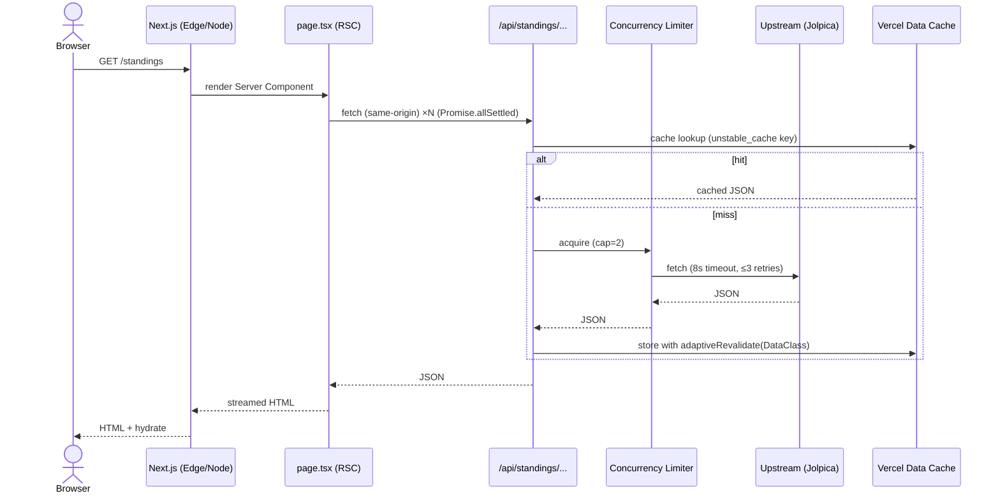
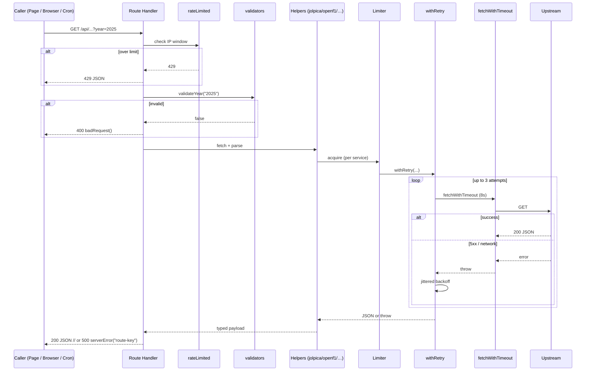

# 04 — Request Lifecycle

Two paths matter: a **page load** (SSR) and an **API route call**
(server-internal or client-driven). They share the same data-fetching stack but
arrive there from different places.

## A) Loading a page (SSR)

Example: `GET /standings`.



PlantUML: [diagrams/request-lifecycle-page.puml](diagrams/request-lifecycle-page.puml).

Key points:

- Server components fetch via **same-origin `/api/*`**, not by importing the
  fetcher directly. This keeps a single contract and lets the browser, RSC, and
  cron all share one entry point.
- They use `Promise.allSettled()` so a single 500 doesn't blank the page.
- The `loading.tsx` skeleton streams while RSCs run.
- After hydration, client components (e.g. live telemetry) take over via React
  Query.

## B) Calling an API route

Every route follows the same skeleton.



PlantUML: [diagrams/request-lifecycle-api.puml](diagrams/request-lifecycle-api.puml).

Authoritative skeleton (copy from [13-recipes.md](13-recipes.md)):

```ts
// src/app/api/example/route.ts
import { NextRequest, NextResponse } from "next/server";
import { rateLimited } from "@/lib/api/withRateLimit";
import { badRequest, serverError } from "@/lib/api/routeHelpers";
import { validateYear } from "@/lib/validators";
import { adaptiveRevalidate } from "@/lib/cacheStrategy";

export const revalidate = 21600; // see cacheStrategy.ts for the literal

export async function GET(req: NextRequest) {
  const limited = rateLimited(req, "example");
  if (limited) return limited;

  const year = req.nextUrl.searchParams.get("year");
  if (!validateYear(year)) return badRequest("Invalid year");

  try {
    const data = await fetchExample(year!); // wraps createApiFetcher
    return NextResponse.json(data, {
      headers: { "Cache-Control": `s-maxage=${adaptiveRevalidate("seasonSchedule")}` },
    });
  } catch (err) {
    return serverError(err, "example");
  }
}
```

Why this order matters:

- **Rate limit first** so abusive clients never reach the upstream API.
- **Validate next** so we never forward garbage to Jolpica/OpenF1.
- **Try / catch with stable identifier** so logs are grep-able
  (`serverError(err, "compare-season")` not `"/api/compare?year=2025…"`).
- **Headers last** so we attach the right `s-maxage` even if it's served from a
  warm cache hit.

## Client-side fetches

Client components use React Query keyed by URL. Defaults are set in
[providers.tsx](../src/components/providers.tsx):

- `staleTime`: 2 minutes (data class can override per-query)
- `gcTime`: 10 minutes
- `retry`: 1
- `refetchOnWindowFocus`: false

Live components override `staleTime` and pass `refetchInterval` for telemetry.
See [05-data-fetching.md](05-data-fetching.md).

Next: [05 — Data Fetching Layer](05-data-fetching.md).
