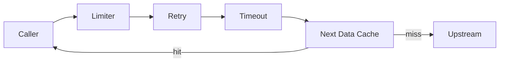

# 05 — Data Fetching Layer

Every byte of upstream data flows through one factory: `createApiFetcher()`. If
you find code that calls `fetch()` directly to an external host, that's a bug.

## The factory

[src/lib/api/createApiFetcher.ts](../src/lib/api/createApiFetcher.ts):

```ts
export function createApiFetcher(
  baseUrl: string,
  serviceName: string,
  maxConcurrent: number = DEFAULT_MAX_CONCURRENT, // 2
) {
  const limiter = createConcurrencyLimiter(maxConcurrent);

  return async function apiFetch<T>(path: string, revalidate: number): Promise<T> {
    return withRetry(async () => {
      await limiter.acquire();
      try {
        const res = await fetchWithTimeout(`${baseUrl}${path}`, {
          next: { revalidate },
          headers: { Accept: "application/json" },
        });
        if (!res.ok) {
          throw new Error(`${serviceName} fetch failed: ${res.status} ${path}`);
        }
        return (await res.json()) as T;
      } finally {
        limiter.release();
      }
    });
  };
}
```

What you get for free, in order:

1. **`withRetry`** — bounded retry with jittered backoff. Up to 3 attempts on
   network errors, 429, and 5xx. Source:
   [src/lib/api/retry.ts](../src/lib/api/retry.ts).
2. **`limiter.acquire`** — per-service semaphore. Default cap is 2 in-flight
   requests per upstream. Stops a 10-driver fan-out from tripping Jolpica's
   ~4 req/s soft cap. Source:
   [src/lib/api/concurrencyLimiter.ts](../src/lib/api/concurrencyLimiter.ts).
3. **`fetchWithTimeout`** — `AbortController`-based fetch with an 8-second
   ceiling. Source:
   [src/lib/api/fetchWithTimeout.ts](../src/lib/api/fetchWithTimeout.ts).
4. **`next: { revalidate }`** — passes the TTL to Next's Data Cache.



Diagram: [Mermaid (renders on GitHub)](diagrams/mermaid/data-fetching-stack.md) · [PlantUML source](diagrams/puml/data-fetching-stack.puml).

## Per-upstream wrappers

One file per upstream binds the factory to its base URL and adds parser
helpers. Open these to see real usage:

| File | Upstream | DataClass it tends to pass |
|---|---|---|
| [jolpica.ts](../src/lib/api/jolpica.ts) | `https://api.jolpi.ca/ergast/f1` | `seasonSchedule`, `liveStandings`, `careerStats`, `circuitRecords` |
| [openf1.ts](../src/lib/api/openf1.ts) | `https://api.openf1.org/v1` | `liveTelemetry`, `liveResults` |
| [openmeteo.ts](../src/lib/api/openmeteo.ts) | Open-Meteo forecast | `weather` |
| [wikidata.ts](../src/lib/api/wikidata.ts) | Wikidata SPARQL/REST | `socialBio` |
| [rss.ts](../src/lib/api/rss.ts) | Various RSS feeds | `newsFeed` |
| [multiviewer.ts](../src/lib/api/multiviewer.ts) | MultiViewer API | `circuitMeta`, `liveIncidents` |

Skeleton of a wrapper (paraphrased):

```ts
// src/lib/api/jolpica.ts (internal helper pattern)
import { createApiFetcher } from "@/lib/api/createApiFetcher";
import { adaptiveRevalidate, type DataClass } from "@/lib/cacheStrategy";

const jolpicaFetch = createApiFetcher("https://api.jolpi.ca/ergast/f1", "jolpica");

async function jolpicaApi<T>(path: string, dataClass: DataClass): Promise<T> {
  return jolpicaFetch<T>(path, adaptiveRevalidate(dataClass));
}
```

**The `dataClass` argument is mandatory** — that's the only knob you turn for
freshness. Never pass a raw integer.

## Jolpica helper pattern

For Jolpica fetchers, prefer shared MRData helpers instead of ad hoc envelope
unwrapping and custom pagination loops:

- `firstRaceField(data, "Results")` for `MRData.RaceTable.Races[0]?.Results ?? []`
- `firstRace(data)` for `MRData.RaceTable.Races[0] ?? null`
- `paginateMRData(fetchPage, extractRows, pageSize)` for limit/offset/total loops

Source of truth: [src/lib/api/mrData.ts](../src/lib/api/mrData.ts).

## Route helpers

[src/lib/api/routeHelpers.ts](../src/lib/api/routeHelpers.ts) exports:

```ts
badRequest(message: string)                    // 400 with { error }
notFound(message?: string)                     // 404
serverError(routeName: string, err: unknown)   // 500 with stable log key
gracefulDegradation(routeName, reason, err?, extra?) // 200 with { available:false, reason }
cachedJson(body, dataClass)                    // JSON + Cache-Control via edgeCacheControl()
```

Always use these instead of hand-rolled `NextResponse` shapes. They keep the
wire contract consistent and log a stable `routeKey` so Vercel logs are grep-able.

`routeKey` examples: `compare-season`, `driver-photos`, `projections-snapshot`.
Do **not** include query strings.

## Rate limiting

[src/lib/api/withRateLimit.ts](../src/lib/api/withRateLimit.ts) exposes
`rateLimited(req, routeKey)`. It returns a `NextResponse` if the request
exceeds its sliding window, or `null` if it's allowed.

```ts
export async function GET(req: NextRequest) {
  const limited = rateLimited(req, "drivers-list");
  if (limited) return limited;
  // ...
}
```

Implementation lives in [src/lib/ratelimit.ts](../src/lib/ratelimit.ts) — an
in-memory sliding window per IP. It's intentionally per-instance: Vercel
serverless functions are short-lived, so an attacker recycling instances pays
the upstream cost anyway, but on a hot instance a single client is bounded.

## Client-side fetching

Client components use **TanStack React Query 5**. Defaults are in
[src/components/providers.tsx](../src/components/providers.tsx):

```ts
new QueryClient({
  defaultOptions: {
    queries: {
      staleTime: 2 * 60 * 1000,     // 2 min
      gcTime: 10 * 60 * 1000,       // 10 min
      retry: 1,
      refetchOnWindowFocus: false,
      refetchOnReconnect: "always",
    },
  },
});
```

Override per query when the data tier demands it:

```ts
const { data } = useQuery({
  queryKey: ["telemetry", sessionKey],
  queryFn: () => fetchJson<TelemetryPayload>(`/api/telemetry?session=${sessionKey}`),
  staleTime: 5_000,
  refetchInterval: 10_000, // sub-minute polling for live data
});
```

For long-lived static-ish data, push `staleTime` up to an hour or more (driver
profiles, schedule).

When a page owns several related queries, extract them to a dedicated hook so
the page can focus on rendering. Example:
`src/hooks/useDriverDetails.ts` centralizes the drivers-page standings, photos,
news, season, career, and wikidata queries and returns typed slices.

Additional hook extraction examples:
- `src/hooks/useDriverComparison.ts` for compare-page standings/schedule/season/circuit queries
- `src/hooks/useCircuitData.ts` for circuit-info + race-incidents query pairing

## When upstream is wholly unavailable

Real example: OpenF1 returns a 403 / paywall response when a FOM live session is
in progress. The drivers page handles this by:

1. The `/api/driver-photos` route catches the failure inside its try.
2. It returns the **last known good photos** from a module-scoped variable.
3. If even that is empty, it returns `{ photos: [] }` with cache headers.
4. `DriverHeadshot` falls back to a static team-coloured silhouette.

See [Mermaid (renders on GitHub)](diagrams/mermaid/driver-photos-fallback.md) · [PlantUML source](diagrams/puml/driver-photos-fallback.puml).

This is the canonical pattern. Whenever an upstream blip would leave a section
blank, prefer **graceful degradation with a documented partial shape** over a
500.

Next: [06 — Caching Strategy](06-caching.md).
