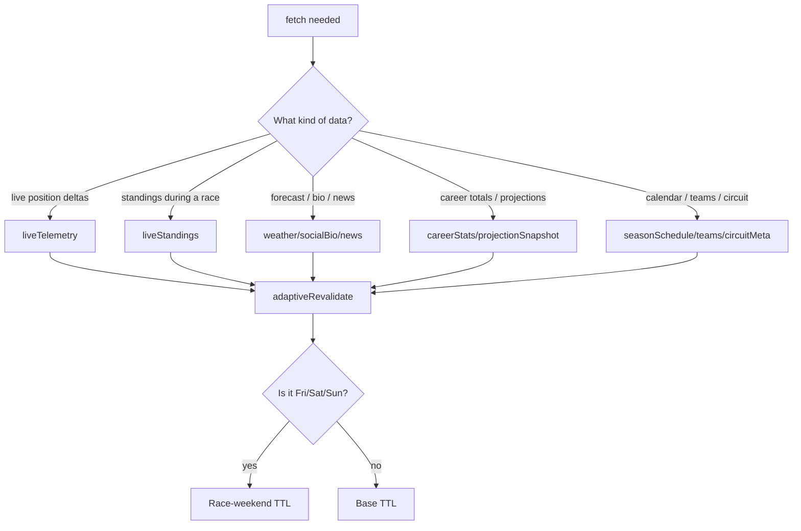

# 06 — Caching Strategy

We cache aggressively because the upstreams are public, rate-limited, and
sometimes slow. The model is intentionally simple:

> Every fetch declares a **`DataClass`**. `adaptiveRevalidate(dataClass)` is
> the only function that picks a TTL.

Source: [src/lib/cacheStrategy.ts](../src/lib/cacheStrategy.ts).

## The five tiers

| Tier | DataClasses | Base TTL | Race-weekend TTL |
|---|---|---|---|
| **live-session** | `liveTelemetry` | 10 s | 5 s |
| **live-meta** | `liveStandings`, `liveResults`, `liveIncidents` | 5 min | 1 min |
| **daily** | `weather`, `socialBio`, `news` | 15–60 min | 5–15 min |
| **weekly** | `careerStats`, `driverProfile`, `circuitRecords`, `projectionSnapshot` | 7 days | 7 days |
| **seasonal** | `seasonSchedule`, `teams`, `circuitMeta` | 24 h | 6 h |

(Legacy keys `standings`, `schedule`, `telemetry`, `news`, `results`,
`projections`, `form` are kept as backwards-compat aliases. New code should
prefer the five-tier keys.)



Diagram: [Mermaid (renders on GitHub)](diagrams/mermaid/caching-decision.md) · [PlantUML source](diagrams/puml/caching-decision.puml).

## The race-weekend heuristic

`isRaceWeekend(now)` is currently a day-of-week check (Fri/Sat/Sun). It's
synchronous and free — no live-session probe. That's a deliberate trade-off:
predictable TTLs, no extra network calls on every request. A future refinement
may consult OpenF1 to detect a *running* session and tighten further; if you
need that behaviour now, branch on `classifySessionState()` instead of on
`adaptiveRevalidate` output.

## How TTLs are applied

Two cache layers stack:

1. **Next Data Cache (`fetch.next.revalidate`)** — handled by
   `createApiFetcher`. The factory passes `revalidate` into the underlying
   `fetch()`. Next stores the response in Vercel's edge cache.
2. **`unstable_cache`** — used by routes for *computed* values (parsed,
   transformed, joined) so we don't re-do work on every cache hit at the fetch
   layer.

Example (paraphrased):

```ts
import { unstable_cache } from "next/cache";
import { adaptiveRevalidate, cacheKeySuffix } from "@/lib/cacheStrategy";

const getDriverProfile = unstable_cache(
  async (driverId: string) => {
    const raw = await fetchJolpica(`drivers/${driverId}.json`, "driverProfile");
    return normalize(raw);
  },
  ["driver-profile", cacheKeySuffix("driverProfile")],
  { revalidate: adaptiveRevalidate("driverProfile") },
);
```

Always include `cacheKeySuffix(dataClass)` in the key — it partitions cache rows
by tier so changing a TTL doesn't accidentally serve old data.

## Bumping a cache key

If a route's *output shape* changes (renamed field, new column), bump the
version segment in the cache key:

```ts
unstable_cache(fn, ["driver-photos-v4-monthly"], { revalidate: ... });
                              ^ bump here
```

This was the fix for the recent driver-photos incident — bumping `v3` → `v4`
forced a fresh cache row after the schema was tweaked. Do this whenever the
*shape* changes; you don't need to bump for a pure TTL change.

## Client-side staleness

[providers.tsx](../src/components/providers.tsx) sets React Query defaults:

| Setting | Default |
|---|---|
| `staleTime` | 2 minutes |
| `gcTime` | 10 minutes |
| `retry` | 1 |
| `refetchOnWindowFocus` | false |
| `refetchOnReconnect` | "always" |

Per-query overrides:

| Data | `staleTime` | `refetchInterval` |
|---|---|---|
| Telemetry (live) | 5 s | 10 s |
| Standings during a race | 30 s | 60 s |
| Driver photos | 5 min | n/a |
| Schedule | 1 h | n/a |
| Career stats | 30 min | n/a |

Rule of thumb: client `staleTime` should be **<= server TTL**. Otherwise the
browser keeps showing stale data after the server has refreshed.

## Forced refresh patterns

| Need | How |
|---|---|
| Bust the server cache | Bump the version segment in the `unstable_cache` key |
| Bust the client cache | `queryClient.invalidateQueries({ queryKey: [...] })` |
| Force one client refetch | `refetchOnMount: "always"` on the `useQuery` |
| Trigger a cron-driven recompute | Cron POSTs to `.../snapshot` with `CRON_SECRET` |

## Magic-number rule

There should be **zero** raw second-counts in `src/app/**` outside of:

- Segment config exports (`export const revalidate = 21600;`) — must be literal.
- `src/lib/cacheStrategy.ts` itself.

If lint or review flags a magic number, route it through `adaptiveRevalidate`.

Next: [07 — API Routes Catalog](07-api-routes.md).

## Snapshot cold tier

Routes for standings, schedule, career stats, and circuit records read from
pre-committed JSON snapshots in `data/snapshots/` before ever calling Jolpica.
GitHub Actions refresh these on a cron schedule.

**Operator reference:** [docs/RUNBOOK_SNAPSHOTS.md](../docs/RUNBOOK_SNAPSHOTS.md)
