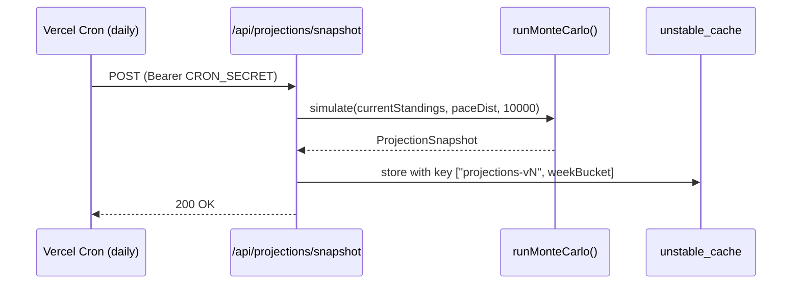

# 09 — Stats & Projections

The numbers shown on the dashboard are computed from raw upstream data by
**pure functions** in `src/lib/stats/` and `src/lib/projections/`. Pure means:

- No HTTP. Input is already-parsed JSON.
- No `Date.now()`, `Math.random()`, or other ambient state (except inside the
  Monte Carlo simulator, which takes a seeded RNG).
- Deterministic — same input, same output. This is why the tests don't need
  network mocks.

## Stats

Folder: `src/lib/stats/`. Each file owns one concept.

| Module | What it computes |
|---|---|
| `driverCareer.ts` | Typed career aggregate payload from upstream totals |
| `form.ts` | Last-N race form chip inputs (avg points, podium ratio, trend) |
| `headToHead.ts` | Compare two drivers across a season or career |
| `pace.ts` | Race pace median + spread per stint |
| `incidents.ts` | Roll up race-control events into per-driver summaries |
| `driverMapping.ts` | Reconcile Jolpica `driverId` ↔ OpenF1 `driver_number` |

The API routes consume these by:

```ts
// /api/driver-career/route.ts (paraphrased)
const raw = { wins, p2, p3, starts, fastestLaps, championships };
const stats = buildDriverCareerStats(raw);
return NextResponse.json(stats);
```

Adding a new stat:

1. Write the **pure function** in `src/lib/stats/<area>.ts`.
2. Write its unit tests in `src/lib/stats/__tests__/<area>.test.ts` (happy path,
   empty input, malformed input).
3. Plumb it through a route in `src/app/api/<route>/route.ts`.
4. Render it in a component.

The order matters — the pure function should land in TDD style before any
route or UI work.

## Projections (Monte Carlo)

Folder: [src/lib/projections/](../src/lib/projections/).

The championship-projections page shows, for each driver: probability of
finishing the season in each position. We compute this by simulating the
remaining races thousands of times.

### Simulator

[src/lib/projections/montecarlo.ts](../src/lib/projections/montecarlo.ts) takes:

- Current standings (points per driver)
- Per-driver pace distribution (mean + stddev) — derived from recent form
- Remaining races count
- A seeded RNG (so tests are deterministic)

It runs N (default 10,000) simulations of each remaining race, sorts drivers by
sampled pace, applies F1 points, and tallies the final positions.

```
for each driver, for each finishing position 1..20:
    probability = count_finished_there / N
```

### Snapshot pipeline

Monte Carlo is too expensive to run inline on every request. So it's a
cron-driven snapshot pattern:



Diagram: [Mermaid (renders on GitHub)](diagrams/mermaid/projections-cron.md) · [PlantUML source](diagrams/puml/projections-cron.puml).

`/api/projections` (GET) just reads the cached snapshot. If the cache is cold
(first deploy, or schema bump), it returns `{ available: false, reason }` and
the page shows a friendly message. The cron will warm it within 24 hours.

### Why a snapshot, not live compute?

- 10,000-simulation jobs take ~5 seconds. Way over a request budget.
- Output changes meaningfully only after a race, not minute-to-minute.
- Snapshotting lets the route return in ~50 ms with no upstream cost.

If you bump the simulation logic or add new fields, **bump the cache-key
version** (`["projections-v3", ...]` → `["projections-v4", ...]`) and let the
next cron warm it.

## Incident parser

[src/lib/incidents/buildIncidents.ts](../src/lib/incidents/buildIncidents.ts)
takes MultiViewer race-control events and normalises them into our internal
shape (driver, lap, type, category, message). It's pure and heavily unit
tested — that's how we get away with parsing a free-text feed.

## Testing the math

The biggest payoff of the pure-function discipline is testability:

```ts
// src/lib/stats/__tests__/driverCareer.test.ts
it("sums wins + p2 + p3 into podiums", () => {
  const result = buildDriverCareerStats({ wins: "1", p2: "2", p3: "3" });
  expect(result.podiums).toBe(6);
});

it("keeps podiums null if any podium component is missing", () => {
  expect(buildDriverCareerStats({ wins: "1", p2: "2" }).podiums).toBeNull();
});
```

No mocks, no fetch, no React. Just data in, data out. Aim for this style in
every new computation.

Next: [10 — Components & Theming](10-components-theming.md).
