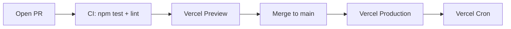

# 12 — Deployment

We deploy to **Vercel**. Two long-lived environments: Preview (per PR) and
Production (per push to `main`).

## Pipeline



There's no separate staging. Production behaviour is exercised by smoke tests
against the live deploy after each promotion.

## Environment variables

Vercel-managed:

| Var | Purpose | Source |
|---|---|---|
| `CRON_SECRET` | Bearer token validated by cron-protected routes | Vercel-generated |
| `VERCEL_URL` | Auto-set by Vercel; used in absolute-URL builders | Vercel |

That's it. Every upstream is free and keyless.

## Cron schedules

[vercel.json](../vercel.json):

```json
{
  "crons": [
    { "path": "/api/projections/snapshot?season=current", "schedule": "0 6 * * *" },
    { "path": "/api/standings?season=current",            "schedule": "15 6 * * *" },
    { "path": "/api/schedule?season=current",             "schedule": "30 6 * * *" }
  ]
}
```

All run daily at 06:00–06:30 UTC. Vercel sends them with
`Authorization: Bearer ${CRON_SECRET}`. Routes that mutate cache must check the
header (see [07-api-routes.md](07-api-routes.md) — Cron-protected routes).

In addition, two **GitHub Actions** populate the snapshot tier
(`data/snapshots/*.json`) and commit changes directly to `main`:

| Workflow | Schedule | What it writes |
|---|---|---|
| [snapshot-daily.yml](../.github/workflows/snapshot-daily.yml) | `0 5 * * *` UTC (00:00 ET) + every push to `main` | `standings-current.json`, `schedule-current.json`, `season-results-current.json` |
| [snapshot-weekly.yml](../.github/workflows/snapshot-weekly.yml) | `30 5 * * 1` UTC (Mon 00:30 ET) | `driver-career-*.json`, `circuit-records-*.json`, `driver-seasons-*.json` |

The runbook (manual refresh, rollback, diagnosing 429 storms) lives at
[docs/RUNBOOK_SNAPSHOTS.md](../docs/RUNBOOK_SNAPSHOTS.md).

## CI workflows

| Workflow | When it runs | What it does |
|---|---|---|
| [test.yml](../.github/workflows/test.yml) | every PR + push to main | `npm test`, lint, build |
| [smoke-production.yml](../.github/workflows/smoke-production.yml) | hourly + manual | `tools/smoke-api.mjs` against production |
| [snapshot-daily.yml](../.github/workflows/snapshot-daily.yml) | see above | daily Jolpica snapshot writer |
| [snapshot-weekly.yml](../.github/workflows/snapshot-weekly.yml) | see above | weekly career/circuit writer |
| Dependabot | weekly | dependency PRs (npm + GitHub Actions) |


To add a cron:

1. Add an entry to `vercel.json`.
2. Make sure the route checks `CRON_SECRET`.
3. Document the cadence + purpose in this chapter.
4. Keep the path short and stable; logs are easier that way.

## Build

`npm run build` runs Next's production build (Turbopack-prod-ready) and emits
to `.next/`. Vercel runs the same command.

A few build-time invariants you'll trip over:

| Rule | Why |
|---|---|
| Segment config exports must be literal: `export const revalidate = 21600;` | Next reads them statically at build time. `6 * 3600` will fail. |
| Don't import server-only modules into client components | Build error |
| Don't import client-only modules into server components without `dynamic({ ssr:false })` | Build error |
| `next/image` `remotePatterns` must list every host you load images from | Otherwise images 404 |

Snapshot-backed API routes pin `preferredRegion` using literal segment exports
(for example `"iad1"`) while staying on Node runtime. Do not switch these
routes to Edge runtime while they depend on filesystem snapshot reads via
`readSnapshotOrFetch`.

Run `npm run build` locally **before** pushing whenever you touch:

- `src/app/**`
- Any segment config export
- Chart components (Nivo types are strict)

## Verifying a deploy

After a production deploy:

```bash
npm run smoke:api
```

This hits the live `/api/*` endpoints with a few representative requests and
verifies the shape. Source: [tools/smoke-api.mjs](../tools/smoke-api.mjs). Add
new endpoints to the smoke script when you add them to the catalog.

Then click through:

- `/standings` — current standings, no blanks
- `/schedule` — current season
- `/race/<year>/<round>` of the latest race — circuit map + laps + incidents
- `/drivers` — portraits present (or fallbacks if OpenF1 paywalled)
- `/projections` — either a snapshot or `available: false` with a friendly message
- `/weekend` — live UI loads, telemetry polls (only meaningful during a session)

## Rolling back

Vercel's Deployments tab → choose a previous deploy → "Promote to Production".
There's no migration to worry about; the app is stateless (everything's a
cache).

## Headers and security

[next.config.ts](../next.config.ts) sets:

- **CSP**: `default-src 'self'`, `connect-src 'self'`, `img-src 'self' data: <approved hosts>`
- **HSTS**: strict, long max-age
- **X-Frame-Options**: `DENY`
- **Referrer-Policy**: `strict-origin-when-cross-origin`

Don't add inline scripts. If you must add a new image host, append it to
`images.remotePatterns` *and* to the CSP allow-list.

## Observability

- **Vercel logs** — primary. `serverError(err, "compare-season")` uses
  `routeKey` as the stable log key for grep.
- **Speed Insights** — Vercel built-in. Watch LCP and CLS after layout changes.
- **No external APM** today. If we add one, it goes in `providers.tsx`.

## Push gate (final reminder)

Before `git push origin <branch>`:

```bash
npm test          # must be green
npm run lint      # must be clean
npm run build     # must succeed when src/app/** touched
```

Anything red blocks the push. Don't use `--no-verify`.

Next: [13 — Recipes](13-recipes.md).
