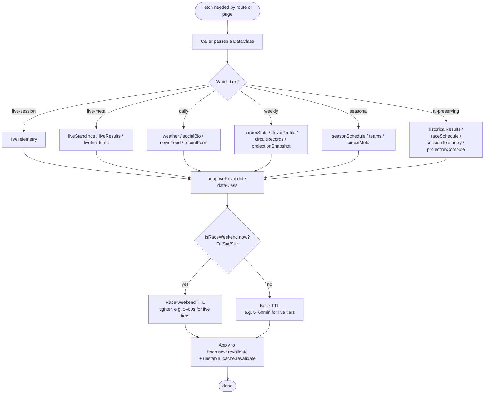

# Caching Decision — Picking a TTL

Routes never hardcode TTLs. They pass a `DataClass` to `adaptiveRevalidate()`, which factors in the race-weekend window.

> All TTLs declared in `src/lib/cacheStrategy.ts`. No raw numbers in routes.

Source of truth (PlantUML): [../puml/caching-decision.puml](../puml/caching-decision.puml).
