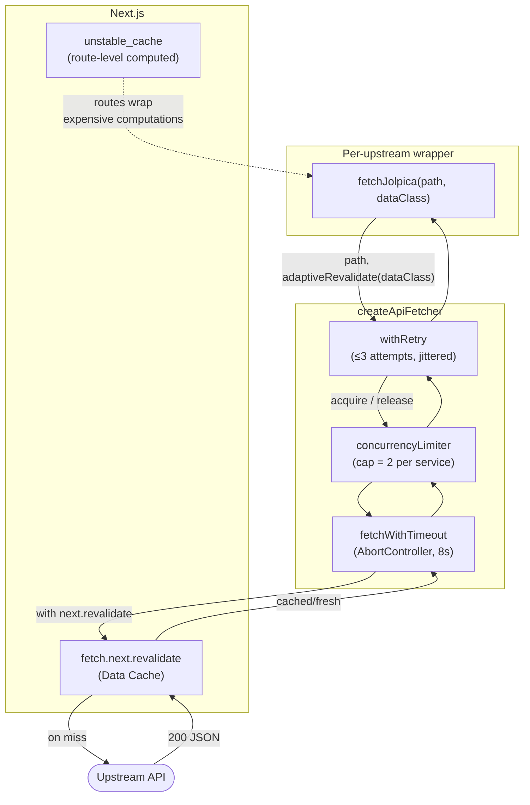

# Data Fetching Stack — `createApiFetcher`

Per-upstream wrappers compose retry, concurrency, timeout, and Next.js caching layers.

- **Retries on:** network error, HTTP 429 / 5xx, timeout.
- **Default cap = 2.** Lower in `createApiFetcher(base, name, 1)` for stricter upstreams.

Source of truth (PlantUML): [../puml/data-fetching-stack.puml](../puml/data-fetching-stack.puml).
