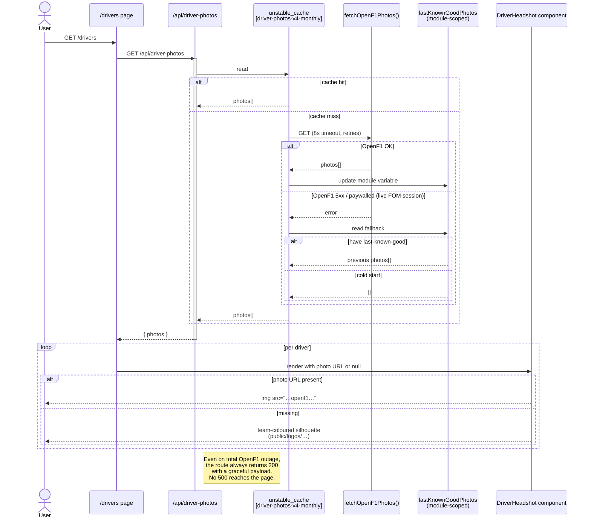

# Driver Photos — Graceful Degradation

Even on a total OpenF1 outage, the route returns 200 with a usable payload.

Source of truth (PlantUML): [../puml/driver-photos-fallback.puml](../puml/driver-photos-fallback.puml).
