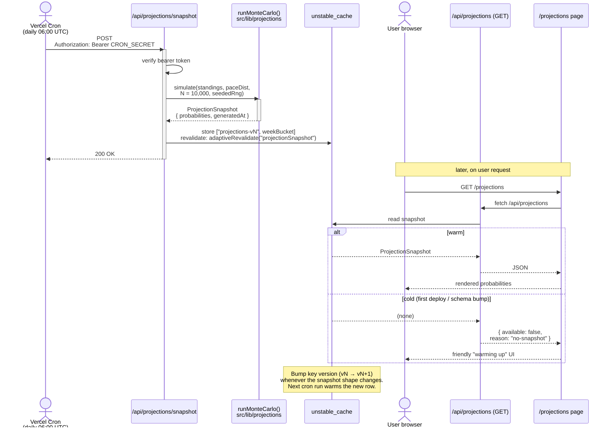

# Projections — Cron-driven Monte Carlo Snapshot

Vercel Cron warms a cached snapshot daily; user requests just read it.

Source of truth (PlantUML): [../puml/projections-cron.puml](../puml/projections-cron.puml).
