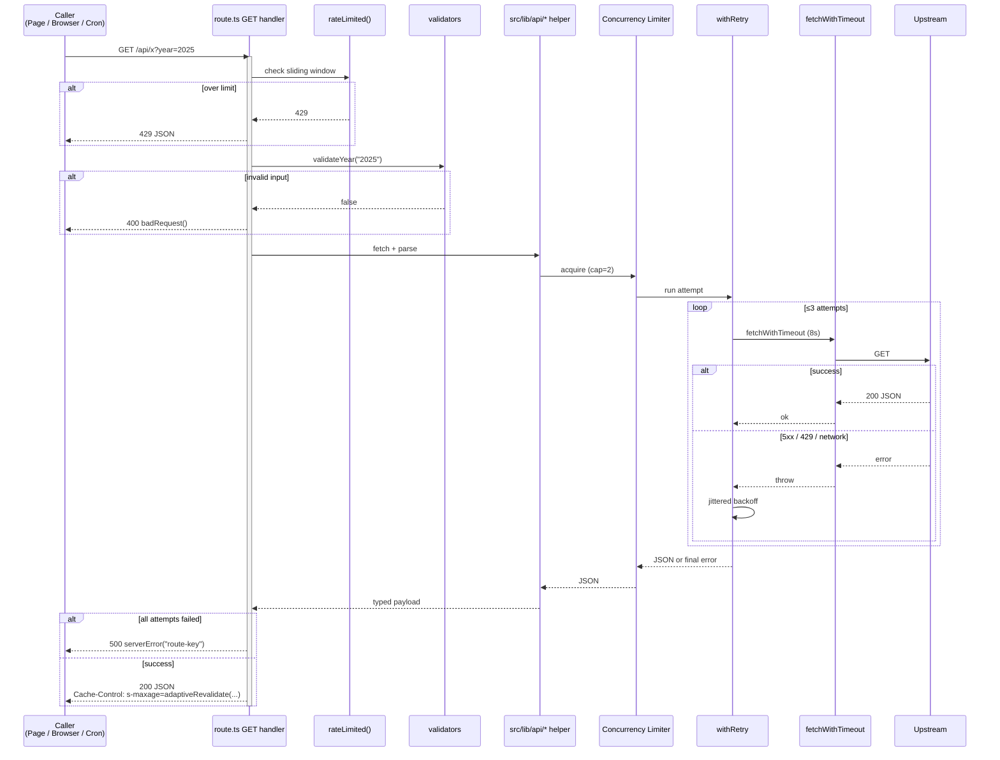

# Request Lifecycle — API Route

Rate limit → validate → fetch with retries → respond.

```mermaid
sequenceDiagram
    participant Caller as Caller<br/>(Page / Browser / Cron)
    participant Route as route.ts GET handler
    participant RL as rateLimited()
    participant V as validators
    participant H as src/lib/api/* helper
    participant L as Concurrency Limiter
    participant Retry as withRetry
    participant T as fetchWithTimeout
    participant U as Upstream

    Caller->>Route: GET /api/x?year=2025
    activate Route

    Route->>RL: check sliding window
    alt over limit
        RL-->>Route: 429
        Route-->>Caller: 429 JSON
    end

    Route->>V: validateYear("2025")
    alt invalid input
        V-->>Route: false
        Route-->>Caller: 400 badRequest()
    end

    Route->>H: fetch + parse
    H->>L: acquire (cap=2)
    L->>Retry: run attempt
    loop ≤3 attempts
        Retry->>T: fetchWithTimeout (8s)
        T->>U: GET
        alt success
            U-->>T: 200 JSON
            T-->>Retry: ok
        else 5xx / 429 / network
            U-->>T: error
            T-->>Retry: throw
            Retry->>Retry: jittered backoff
        end
    end
    Retry-->>L: JSON or final error
    L-->>H: JSON
    H-->>Route: typed payload

    alt all attempts failed
        Route-->>Caller: 500 serverError("route-key")
    else success
        Route-->>Caller: 200 JSON<br/>Cache-Control: s-maxage=adaptiveRevalidate(...)
    end
    deactivate Route
```

Source of truth (PlantUML): [../puml/request-lifecycle-api.puml](../puml/request-lifecycle-api.puml).
