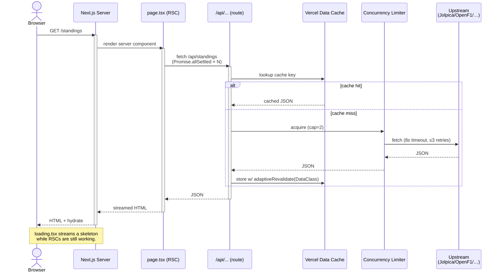

# Request Lifecycle — Page (SSR)

How a server-rendered page resolves data through the API layer and Vercel Data Cache.

Source of truth (PlantUML): [../puml/request-lifecycle-page.puml](../puml/request-lifecycle-page.puml).
