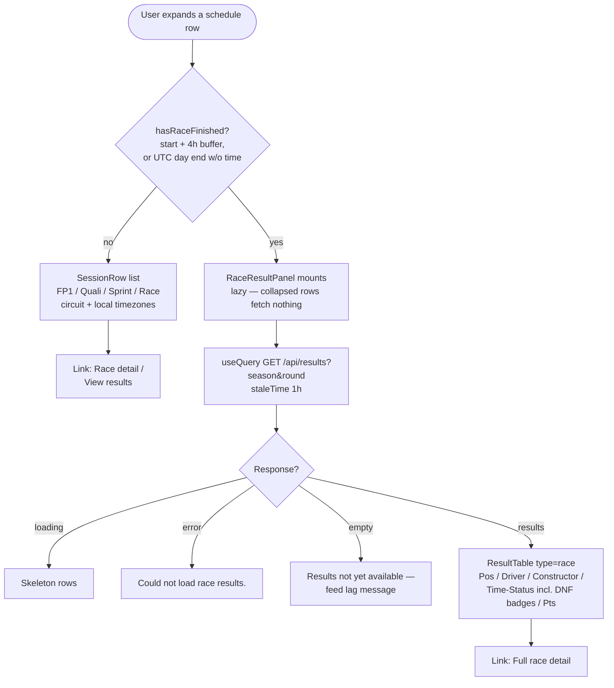

# Schedule Row Expand — Timings vs Race Classification

Expanding a race row on `/schedule` shows different content depending on whether the race has actually run. The gate is `hasRaceFinished()` (race start + 4 h buffer, or end of the UTC race day when no start time exists) — deliberately stricter than the date-only "Done" badge check, so race-day mornings still show session timings.

> The classification rendering is shared with the race-detail page — `RaceResultPanel` only owns the fetch + loading/error/empty states and delegates rows to [`ResultTable`](../../../src/components/race/ResultTable.tsx).

Source of truth (PlantUML): [../puml/schedule-row-expand.puml](../puml/schedule-row-expand.puml).
