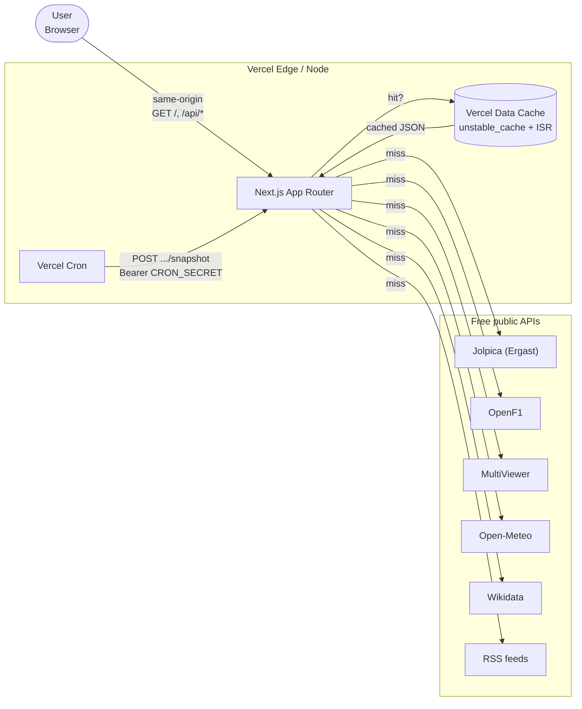

# System Context

F1 Dashboard — System Context. Browser talks only to Next.js (same-origin); the app server fans out to free public APIs and caches results.

> CSP: `connect-src 'self'`. The browser never calls upstreams directly.

Source of truth (PlantUML): [../puml/system-context.puml](../puml/system-context.puml).
